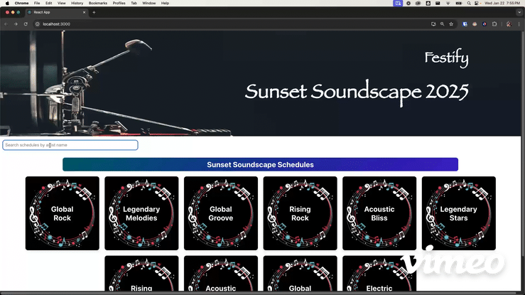
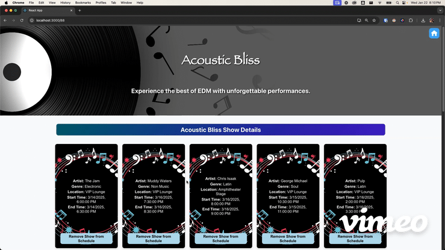
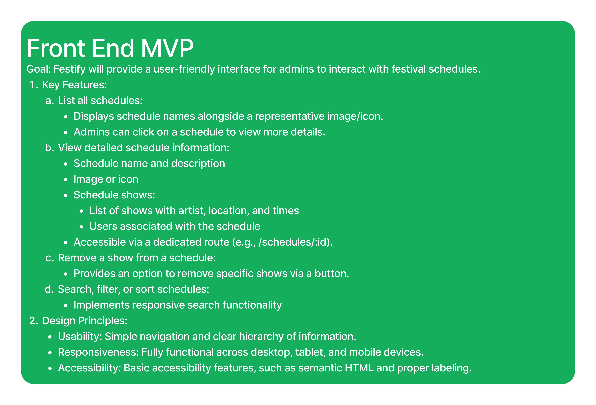

# README

# Festify Frontend

## Abstract
Festify is a music festival scheduling application designed to provide festival administrators with detailed information about festival schedules, shows, and attendees. Administrators can view individual schedule details, including show times, locations, and artists. Schedules can also be searched by artist name, and a show can easily be removed from a schedule by clicking a button.

## Contributor
Danielle Cardona - [LinkedIn](https://www.linkedin.com/in/danielle-cardona-se/), [GitHub](https://github.com/dcardona23)

## Previews

## Planning/Wireframing

## Setup Instructions

1. Clone the repository locally

2. Navigate to the project directory
    - cd festify_react

3. Install dependencies 
    - npm install

4. Start the development server
    - npm start

5. Visit the application in your browser
    - http://localhost:3000

6. To fetch data from the backend, you will also need to clone the backend and run the server on localhost:5000
    - rails s -p 5000

## Summary of Technologies
- React: For building a dynamic and interactive user interface.
- React Router: For client-side routing.
- CSS: For styling components and layout.
- Fetch API: For making HTTP requests to the backend.
- JavaScript (ES6): Core language for frontend development.

## Goals
- Provide a seamless administrator experience for exploring festival schedules and details.
- Enable administrators to view artist information and show locations and times.
- Develop a clean, professional UI for schedule and show information.

## Testing
This project uses Cypress for end to end testing to ensure the application's workflows function correctly.

### Running Tests
- Ensure all dependencies are installed.
- Run the test suite:
  - npm run cypress